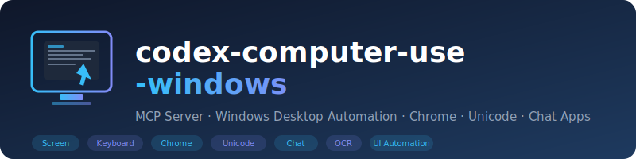

# codex-computer-use-windows

<p align="center">
  
</p>

<p align="center">
  <a href="https://opensource.org/licenses/MIT"></a>
  <a href="https://www.python.org/"></a>
  <a href="https://modelcontextprotocol.io/"></a>
  <a href="https://github.com/ezpzai/codex-computer-use-windows/stargazers"></a>
</p>

<p align="center">
  <b><a href="README.md">English</a></b>
</p>

> Codex가 Windows 데스크탑을 직접 제어할 수 있게 해주는 MCP 서버 — 스크린샷, 마우스, 키보드, 크롬 브라우저, 채팅앱까지 지원합니다.

---

## 개요

[OpenAI Codex](https://github.com/openai/codex)용 MCP(Model Context Protocol) 서버 플러그인입니다. 자연어로 Windows 전체를 제어할 수 있습니다: 스크린샷 촬영, 클릭, 타이핑, 창 관리, 크롬으로 웹 검색, 채팅앱 메시지 전송 등 — 대부분의 작업은 스크린샷 없이도 동작합니다.

---

## 빠른 시작

### 사전 준비

- **Windows 10/11** (대화형 데스크탑 세션)
- **Python 3.10+** (`py` 런처 포함)
- **Codex** CLI 또는 데스크탑 앱

### 설치 및 Codex에 추가

```powershell
# Step 1: 원하는 위치에 클론
git clone https://github.com/ezpzai/codex-computer-use-windows.git %USERPROFILE%\codex-computer-use-windows

# Step 2: MCP 서버로 등록 (Codex CLI)
codex mcp add computer-use -- cmd.exe /d /s /c "%USERPROFILE%\codex-computer-use-windows\scripts\launch-windows.cmd"
```

처음 실행하면 자동으로 가상환경을 만들고 의존성을 설치합니다.

> 위 명령은 `~/.codex/config.toml`에 다음 내용을 자동으로 저장합니다:
> ```toml
> [mcp_servers.computer-use]
> command = "cmd.exe"
> args = ["/d", "/s", "/c", "%USERPROFILE%\\codex-computer-use-windows\\scripts\\launch-windows.cmd"]
> ```

### config.toml 직접 편집

`~/.codex/config.toml`에 직접 추가할 수도 있습니다:

```toml
[mcp_servers.computer-use]
command = "cmd.exe"
args = ["/d", "/s", "/c", "C:\\Users\\사용자명\\codex-computer-use-windows\\scripts\\launch-windows.cmd"]
```

### 독립 서버로 실행

```powershell
cd %USERPROFILE%\codex-computer-use-windows
py -3 -m venv .venv
.venv\Scripts\python.exe -m pip install -r scripts\requirements.txt
.venv\Scripts\python.exe scripts\windows_server.py
```

---

## 도구 목록

| 분류 | 도구 |
|---|---|
| **화면** | `screenshot` · `screenshot_active_window` · `observe_screen` · `get_screen_size` · `get_cursor_position` · `extract_text` · `extract_text_active_window` |
| **마우스 / 키보드** | `click` · `move_mouse` · `drag_mouse` · `type_text` · `type_unicode` · `press_key` · `hotkey` · `scroll` |
| **창 관리** | `list_windows` · `focus_window` · `run_program` · `open_app` · `get_window_text` |
| **클립보드** | `get_clipboard` · `set_clipboard` |
| **크롬** | `chrome_get_url` · `chrome_get_tab_title` · `chrome_navigate` · `chrome_search` · `chrome_read_page` |
| **채팅 / 메시징** | `send_text_to_window` · `send_keys_to_window` |
| **UI 자동화** | `get_ui_tree` · `find_and_click_element` |
| **유틸리티** | `batch_actions` · `wait` |

---

## AI 에이전트용 설치 안내

아래 내용을 에이전트의 시스템 프롬프트, `AGENTS.md`, 또는 `.instructions.md`에 넣으면 AI가 직접 설치하고 사용할 수 있습니다:

````markdown
## Computer Use (Windows) — 설정 및 사용법

Windows 데스크탑 제어용 MCP 서버를 설치합니다:

```bash
git clone https://github.com/ezpzai/codex-computer-use-windows.git %USERPROFILE%\codex-computer-use-windows
codex mcp add computer-use -- cmd.exe /d /s /c "%USERPROFILE%\codex-computer-use-windows\scripts\launch-windows.cmd"
```

그리고 아래 스킬 등록도 추가합니다.

### 스킬 등록

```xml
<skills>
<skill>
  <name>computer-use-windows</name>
  <description>Windows 데스크탑 제어 — 스크린샷, 마우스, 키보드, 크롬, 채팅앱, UI Automation</description>
  <file>skills/computer-use-windows/SKILL.md</file>
</skill>
</skills>
```

### 사용 가능한 작업

- **웹 검색 (스크린샷 불필요):** `chrome_search(query="...", engine="naver|google|daum|bing")`
- **페이지 텍스트 읽기:** `chrome_read_page()`
- **현재 URL 확인:** `chrome_get_url()`
- **URL 이동:** `chrome_navigate(url="https://...")`
- **채팅 메시지 전송:** `send_keys_to_window(title="카카오톡", text="안녕", send_enter=True)`
- **앱 실행:** `open_app("notepad|chrome|kakaotalk|calculator|...")`
- **화면 관찰 (스크린샷 없이):** `observe_screen(include_screenshot=False, include_ui_tree=True)`
- **유니코드 입력:** `type_unicode("한글 텍스트")`
- **창 텍스트 읽기:** `get_window_text(title="메모장")`
````

---

## 제한사항

- 대화형 데스크탑 세션에서만 동작합니다 (헤드리스/RDP 쉐도우 모드 불가)
- 권한 상승 UAC 프롬프트나 보안 데스크탑은 제어할 수 없습니다
- 크롬 도구는 Google Chrome 전용입니다 (Edge/Firefox는 `open_app`으로만 실행 가능)

---

## 기여하기

이슈와 PR 환영합니다: [github.com/ezpzai/codex-computer-use-windows](https://github.com/ezpzai/codex-computer-use-windows)

## 라이선스

[MIT](LICENSE)
