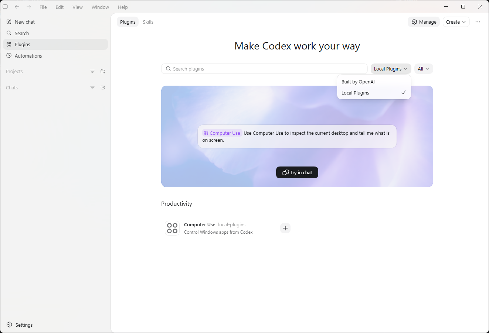

# codex-computer-use-windows

<p align="center">
  
</p>

<p align="center">
  <a href="https://opensource.org/licenses/MIT"></a>
  <a href="https://www.python.org/"></a>
  <a href="https://modelcontextprotocol.io/"></a>
  <a href="https://github.com/ezpzai/codex-computer-use-windows/stargazers"></a>
</p>

<p align="center">
  <b><a href="README.ko.md">한국어</a></b>
</p>

> Windows desktop control for Codex through a local MCP server: screenshots, mouse, keyboard, Chrome, chat apps, and more.

---

## Overview

This repository is meant to be installed as a Codex plugin package.

It already contains plugin metadata in [`.codex-plugin/plugin.json`](.codex-plugin/plugin.json), bundled MCP config in [`.mcp.json`](.mcp.json), and skills in [`skills/`](skills/).

---

## Install

Requirements:

- Windows 10/11
- Python 3.10+ with the `py` launcher
- Codex desktop app

### Method 1. 
## (Automatic) For AI Agent

Copy this into Codex app chat:

```text
Clone https://github.com/ezpzai/codex-computer-use-windows into $HOME\.codex\plugins\computer-use-windows, then add a local plugin entry in ~/.agents/plugins/marketplace.json that points to ./.codex/plugins/computer-use-windows.
```

After installation, restart Codex,
then install `computer-use-windows` from Codex app `Plugins > Local Plugins`.



This repository already includes the files Codex expects:

- [`.codex-plugin/plugin.json`](.codex-plugin/plugin.json)
- [`.mcp.json`](.mcp.json)
- [`skills/computer-use-windows/SKILL.md`](skills/computer-use-windows/SKILL.md)

### Method 2. 
## (Manual) 1. Clone into your local plugins folder

Run this in PowerShell:

```powershell
git clone https://github.com/ezpzai/codex-computer-use-windows.git "$HOME\.codex\plugins\computer-use-windows"
```

### 2. Add one local marketplace entry

Create or update `~/.agents/plugins/marketplace.json`:

```json
{
  "name": "local-plugins",
  "plugins": [
    {
      "name": "computer-use-windows",
      "source": {
        "source": "local",
        "path": "./.codex/plugins/computer-use-windows"
      },
      "policy": {
        "installation": "AVAILABLE",
        "authentication": "ON_INSTALL"
      },
      "category": "Productivity"
    }
  ]
}
```

### 3. Restart Codex and install the plugin

Open `Plugins > Local Plugins`, then install `computer-use-windows`.

Codex reads the bundled `.mcp.json` and `skills/` automatically.

---

## Available Tools

| Category | Tools |
|---|---|
| Screen | `screenshot`, `screenshot_active_window`, `observe_screen`, `get_screen_size`, `get_cursor_position`, `extract_text`, `extract_text_active_window` |
| Mouse and Keyboard | `click`, `move_mouse`, `drag_mouse`, `type_text`, `type_unicode`, `press_key`, `hotkey`, `scroll` |
| Window | `list_windows`, `focus_window`, `run_program`, `open_app`, `get_window_text` |
| Clipboard | `get_clipboard`, `set_clipboard` |
| Chrome | `chrome_get_url`, `chrome_get_tab_title`, `chrome_navigate`, `chrome_search`, `chrome_read_page` |
| Chat and Messaging | `send_text_to_window`, `send_keys_to_window` |
| UI Automation | `get_ui_tree`, `find_and_click_element` |
| Utility | `batch_actions`, `wait` |

---

## Notes

- Works only on an interactive desktop session
- Cannot control elevated UAC prompts or the secure desktop
- Chrome-specific tools target Google Chrome
- `uiautomation` is installed automatically on first use if needed

## Contributing

Issues and PRs are welcome at [github.com/ezpzai/codex-computer-use-windows](https://github.com/ezpzai/codex-computer-use-windows).

## License

[MIT](LICENSE)
